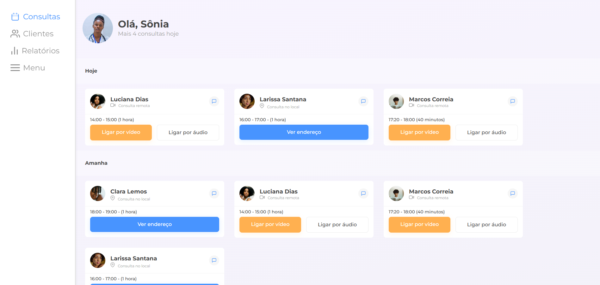

# Medic Schedule

## 📑 Descrição

O **Medic Schedule** é um projeto desenvolvido como parte do desafio de responsividade [**#7DaysOfCode**](https://7daysofcode.io/matricula/responsividade) da Alura. O desafio tinha como objetivo criar uma interface web responsiva que auxilie médicos na visualização de suas agendas de pacientes.

A aplicação permite que médicos acompanhem seus atendimentos diários e semanais, contando com um menu na parte inferior para facilitar a navegação e um botão flutuante agendamento de novas consultas.

## 🚀 Tecnologias Utilizadas

- HTML5  
- CSS3  
- JavaScript  
- Google Fonts  
- Flexbox e Media Queries para responsividade  

## 🎯 Funcionalidades

- Interface responsiva para dispositivos móveis, tablets e desktop  
- Visualização das proximas consultas
- Cards contendo informações como nome do paciente, horário e modalidade da consulta  
- Menu inferior para navegação
- Botão flutuante que abre um overlay com opções para agendar novas consultas
- Botão flutuante para novos agendamentos

## 📱 Layout e Responsividade

O projeto foi desenvolvido com foco total em responsividade, utilizando recursos como **Flexbox** e **Media Queries**. A interface se adapta de maneira eficiente a diferentes tamanhos de tela, proporcionando uma experiência consistente e intuitiva em qualquer dispositivo.

O menu inferior fixo garante fácil acesso às páginas principais, enquanto o botão flutuante melhora a usabilidade, permitindo que o médico acesse rapidamente funções adicionais sem comprometer a navegação.

## 🧠 Aprendizados

Durante o desenvolvimento deste projeto, foram aplicados diversos conceitos importantes para construção de interfaces modernas, como:

- Estruturação semântica com HTML  
- Criação de layouts flexíveis e responsivos utilizando **Flexbox** e **Media Queries**  
- Organização de componentes e hierarquia visual com CSS  
- Aplicação de interatividade e manipulação de elementos com JavaScript  
- Desenvolvimento de soluções centradas na experiência do usuário, especialmente em ambientes mobile-first  

## 🔗 Acesso ao Projeto

[🔗 Visualizar Projeto](https://medic-schedule.vercel.app/)
